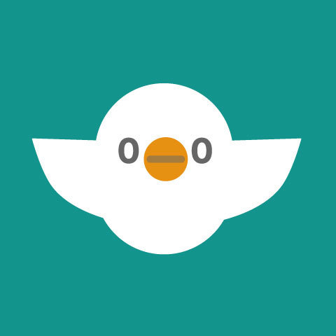

  
   <h1 align="center">esa</h1>

Extension for Raycast to search [esa](https://esa.io/).

## Configuration
You will need some additional steps to install this plugin.

- get esa API Key from `https://[team].esa.io/user/applications`
  - Please enter your team name in `[team]` 
- Install the extension from Raycast Store
- The first time you start the extension, you will be asked to enter the API Key and Team Name.

## Icon License
The esa icons on this page are licensed under a Creative Commons Attribution-NonCommercial-NoDerivatives 4.0 International.
 
